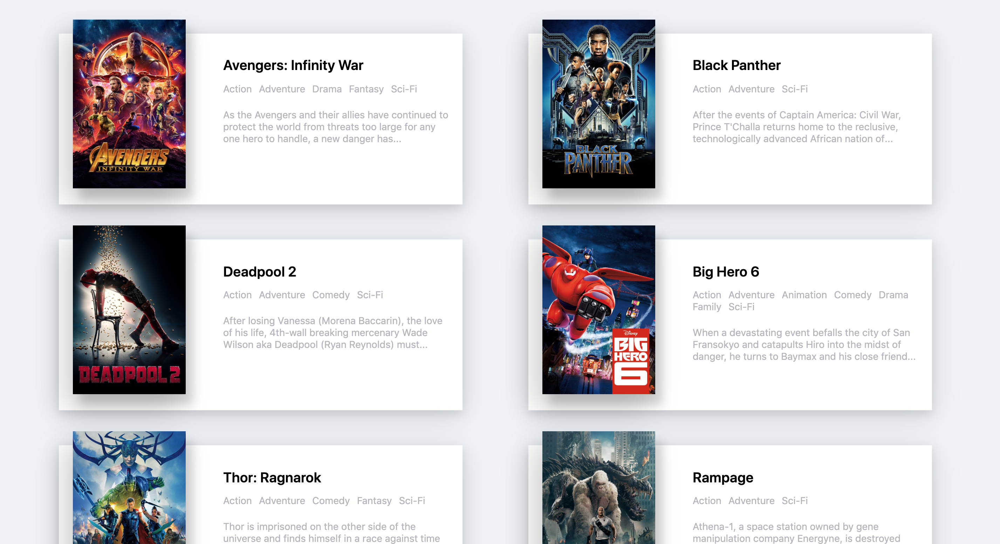

#Movie page

## Contents
#### Moive page to study React Js.

 

## Movie List Page

 

## Documentation
- App.js : It has all the data, and it dispatches data to the components.
- Movie.js : Received the data and configure the components.
- css : It serves to decorate the page.

 

## Note
See the [Note folder]

## Reference
Based on the lecture video of nomad coder. Thank you for the good lecture!

[Note folder]: <./src/Note>
